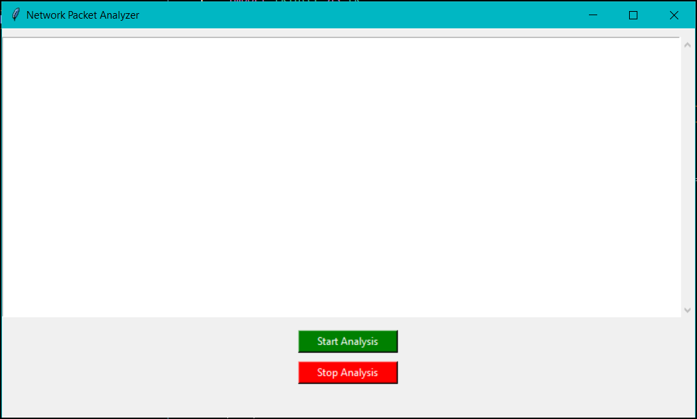

# PRODIGY_CS_05
A simple Python packet analyzer tool for non-technical users, created with Tkinter and Scapy. Capture, view, and understand network packet data like IP addresses, protocols, and payloads with easy-to-use start/stop functionality. Developed as part of a cybersecurity internship at Prodigy InfoTech.

# Easy Packet Analyzer

An easy-to-use packet sniffer tool designed for non-technical users, built in Python using the Scapy and Tkinter libraries. This tool captures network packets in real-time and displays important information such as source and destination IP addresses, protocols, and payload content in a friendly format. Users can start and stop packet analysis with a simple button click.

## Table of Contents
- [Features](#features)
- [Requirements](#requirements)
- [Installation](#installation)
- [Usage](#usage)
- [Screenshots](#screenshots)
- [License](#license)

## Features

- **Start/Stop Analysis**: Users can start and stop packet capturing with simple buttons.
- **Non-Technical Friendly**: Displays easy-to-understand packet details for non-technical users.
- **Real-Time Data**: Captures and displays live packet data including IP addresses, protocol type, and a brief payload summary.
- **Multi-threaded**: Keeps the UI responsive while capturing packets in the background.

## Requirements

- Python 3.x
- Tkinter library (comes with Python)
- Scapy library (install using pip)

## Installation

1. Clone the repository:
    ```bash
    git clone https://github.com/yourusername/Easy-Packet-Analyzer.git
    ```
2. Navigate to the project directory:
    ```bash
    cd Easy-Packet-Analyzer
    ```
3. Install the required libraries:
    ```bash
    pip install scapy
    ```

## Usage

1. Run the application:
    ```bash
    python packet_analyzer.py
    ```
2. Click **Start Analysis** to begin packet capturing.
3. Click **Stop Analysis** to stop capturing packets.
4. View the captured packet details in the text display area.

## Screenshots



## License

This project is licensed under the MIT License - see the [LICENSE](LICENSE) file for details.

